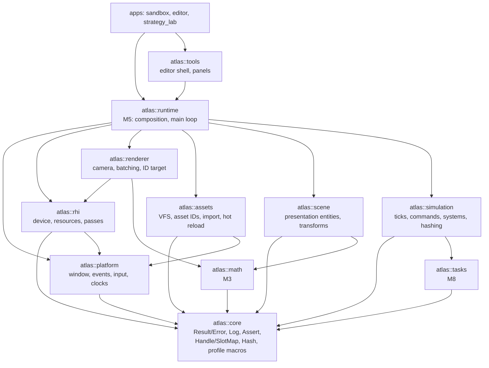
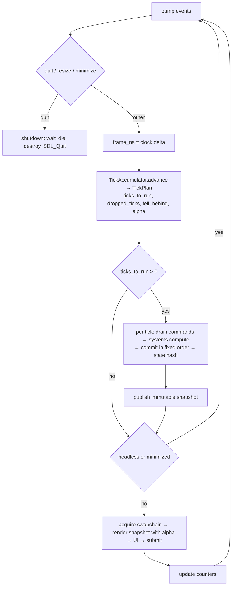

# Architecture

Atlas is a set of static-library modules composed by an application. Every module boundary
is a CMake target; the permitted dependency edges live in `cmake/ModuleGraph.cmake` and are
enforced at configure time and again in CI by `tools/check_module_deps.py`.

## Module graph

Third-party libraries are private to exactly one module: SDL3 to `platform` and `rhi`,
EnTT to `scene`, Dear ImGui to `tools`, Tracy to `core` behind compiled-out macros.
Because static-library `PRIVATE` dependencies propagate as `$<LINK_ONLY:>`, a public
header that includes a third-party header fails to compile in an application. That is the
primary enforcement; the script is the backstop.

`atlas::platform_internal` is an INTERFACE target exposing `SDL_Window*` behind a forward
declaration. Its only permitted consumer is `atlas::rhi`.

## Ownership

| Module | Owns | Never |
|---|---|---|
| core | Errors, logging, assertions, handles, hashing, build info, profiling macros | Knows about windows, GPUs, entities, or ticks |
| math | Vectors, matrices, rectangles, projections | Holds determinism-sensitive simulation logic without tests |
| platform | SDL lifetime, window, events, input, clocks, mount roots | Exposes SDL types in public headers |
| tasks | Worker pool and deterministic parallel-for | Exists before the first parallel benchmark |
| rhi | GPU device, resources as generation handles, passes, uploads | Exposes SDL types; knows about scenes or maps |
| renderer | Camera, batching, targets, culling hooks, debug draw | Mutates simulation or scene state |
| assets | Virtual paths, asset IDs, importers, load states, hot reload | Touches the GPU directly |
| scene | Presentation entities, transforms, hierarchy, serialization | Is the grand-strategy database |
| simulation | Ticks, commands, system contracts, RNG, hashing, replay, snapshots | Contains game rules |
| runtime | Composition, main loop, subsystem lifetimes | Depends on tools or editor code |
| tools | Editor shell, panels, command and undo | Is depended on by runtime modules |
| apps | Composition roots and demonstrations | Hold reusable engine logic |

## Time model

Three distinct notions of time:

| Notion | Representation | Drives |
|---|---|---|
| Real time | `SteadyClock` in core, nanoseconds | UI responsiveness, frame pacing, the accumulator input |
| Render time | seconds since start, plus `alpha` in [0,1) | Interpolation and visual effects |
| Simulation time | `Tick`, a 64-bit integer counter | Authoritative state, commands, hashes |

Rendering never defines simulation correctness. Simulation advances in fixed logical ticks,
never by a variable frame delta.

## Main loop and snapshot flow

Speed is a scheduler policy, never a multiplier inside simulation equations. The policies
are `Paused`, `SingleStep`, `Realtime{num, den}`, and `Unbounded{batch}`. Interactive
policies clamp catch-up work per frame and report how far behind the simulation fell;
surplus ticks are discarded rather than retained, which is what prevents an unbounded
spiral. Unbounded mode ignores wall time and skips rendering to maximise throughput.

The accumulator is integer-only. It is kept in units of nanoseconds multiplied by the tick
rate, so a tick is exactly one billion units at any rate and 60 Hz has no fractional
period. It takes no clock of its own, which is what makes it directly unit-testable, and it
is the reason the steady clock lives in core rather than in platform: nothing in the time
model needs a window system.

### Headless, and why there is no null platform

Headless is a configuration, not a second implementation. `PlatformConfig::video = false`
initialises no video subsystem, and window creation then fails with an error that says so.
A null platform returning stub windows would turn a configuration mistake into a mystery
somewhere else, and would be a second code path to keep working for no user.

Window code is still exercised where there is no display, through SDL's `dummy` video
driver: a real window and a real event pipeline with nothing behind them. That is how
continuous integration covers window creation, resizing and destruction. What it cannot
cover is anything a real window server decides, such as minimise and restore; those are
covered by injecting the events, which tests the translation Atlas is responsible for.

Window state such as minimised or focused is queried from the window system rather than
tracked from events. Tracked state drifts out of sync when an event is missed; a query
cannot.

Snapshots carry presentation-relevant, plainly-copyable, stably-ordered data only. They are
published as `shared_ptr<const Snapshot>` with latest-wins semantics; a renderer pins one
snapshot for a whole frame. This is the one place shared ownership is permitted, and it is
what allows the simulation to move to its own thread later without changing the renderer.

## Threading model

v0.1 is single-threaded by design. Every platform and RHI entry point asserts main-thread
affinity.

| Thread | From | Owns | Must not |
|---|---|---|---|
| Main | M0 | SDL, window, GPU device and all submission, UI, simulation stepping | Block on long I/O inside a frame |
| Asset I/O workers (2, inside `assets`) | M4 | File reads and decoding into CPU buffers | Touch platform, GPU, scene, simulation, or UI |
| Simulation workers (`tasks`) | M8 | Per-system private scratch and output buffers | Mutate shared tables, or touch anything outside simulation |

A render thread is not planned for v0.1 and requires trace evidence plus documented
affinity rules before it could be considered.

## Renderer

`atlas::rhi` is the whole of Atlas's contact with the graphics library. Its public headers
name handles, descriptors and enumerations of Atlas's own; every SDL type stays in
`engine/rhi/src`. The native window handle reaches it through `atlas::platform_internal`, a
target whose only permitted consumer is the renderer, so the one place the boundary has to
open is named in the build system rather than in a comment.

Resources are generation-counted handles from a pool. Destroying a resource bumps its slot's
generation, so an outstanding handle stops resolving rather than dangling, and the device's
destructor reports by name anything still live. SDL_GPU already defers destruction until the
graphics processor has finished with a resource, so there is no deletion queue; ADR-0002
records that reliance.

A frame is a scope. `begin_frame` acquires a command buffer and waits for a swapchain image;
a frame that is dropped without being submitted releases it. Which release is legal depends
on whether an image was acquired: SDL refuses to cancel a command buffer holding one, so
such a frame is submitted instead. A minimised window yields a frame with no image, which is
not an error, and the caller skips drawing.

GPU-side timing is not available: SDL_GPU exposes fences but no timestamp queries. Profiling
zones therefore measure acquire, record and submit on the processor side, and anything
reported as GPU cost says which it is.

## Simulation contract

Designed now, implemented in M6, parallelised in M8:

- Systems have stable IDs and a deterministic order.
- Each system declares its read set and write set at table granularity.
- The compute phase may run concurrently and writes only to system-private buffers.
- The commit phase applies staged mutations in system order, each in stable index order.
- Reductions merge per-worker partials in worker-index order, so no result depends on
  completion order.
- Randomness comes from counter-based streams keyed by seed, stream name, tick, and
  counter. There is no ambient global RNG.
- Commands are stamped with target tick, source, and a monotonic sequence, and are
  validated before they are applied.
- A canonical state hash is computed per tick, with per-system sub-hashes so a divergence
  can be localised.

## Error handling and failure

`atlas::Result<T>` is `std::expected<T, atlas::Error>`. An `Error` carries a code, an
owning message, a source location, and an optional native error code, and can accumulate
context as it propagates. Exceptions are never thrown by engine code and never cross a
module or thread boundary; third-party failures are translated at the boundary.

Assertions are for violated programmer invariants and abort. Recoverable user or data
errors return an `Error`. Untrusted inputs (assets, saves, replays, mods) are validated for
counts, lengths, versions, and bounds before any allocation or indexing.
