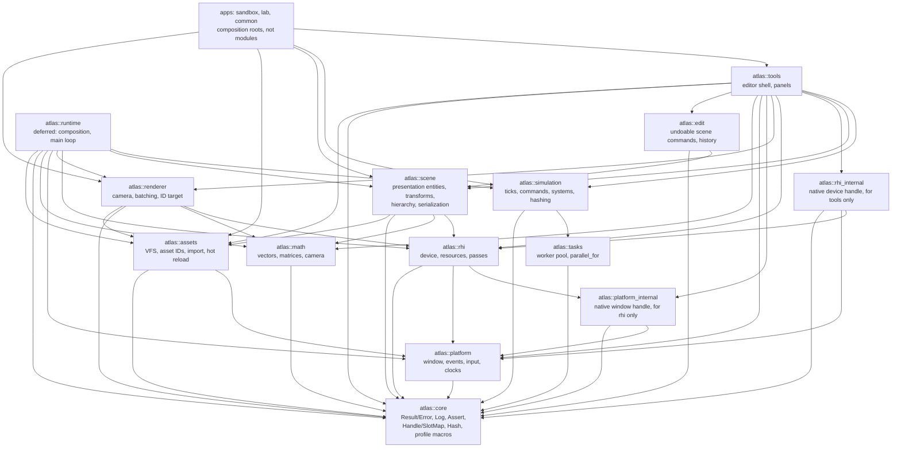
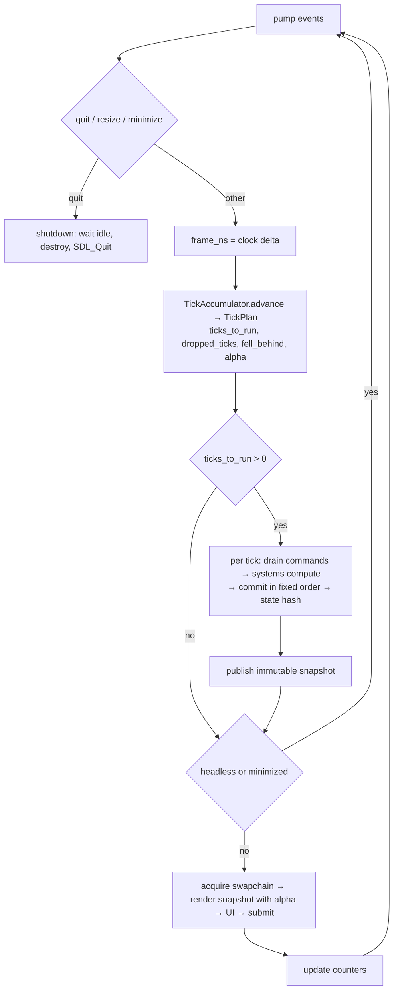

# Architecture

Atlas is a set of static-library modules composed by an application. Every module boundary
is a CMake target; the permitted dependency edges live in `cmake/ModuleGraph.cmake` and are
enforced at configure time and again in CI by `tools/check_module_deps.py`, which also
checks that the diagram below draws exactly the edges the table permits. It had drifted
five ways before M9, so it is now compared rather than trusted.

## Module graph

`atlas::runtime` does not exist. The plan created it in M5 on the assumption that a second
application would need the same composition. M7 brought that second application, the
Strategy Lab, and the assumption was tested line by line: what the two shared was about two
hundred lines of pure utilities (argument plumbing, a frame-time ring, a PPM writer, the run
bounds, the process boundary) and not the frame loop, because the sandbox drives a scene graph
and the lab drives the simulation kernel. The utilities became `apps/common`, a static library
with tests; a `runtime` module remains deferred until a third application, or the two loops
converging in shape rather than in ingredients. `tools` and `apps` therefore depend on the
engine modules directly, which is what the graph above shows.

The lab itself is three targets, and the split is load-bearing: `atlas::lab_sim` holds the
tables, systems, command and snapshot and may link only `atlas::simulation`, which CMake
refuses to let it exceed, so the headless benchmark is independent of rendering by
construction; `atlas::lab_view` holds the cell field and the identifier pass, so the GPU tests
draw with the application's own code; and `apps/lab/main.cpp` is the composition root that
puts a window, a device and an overlay around them.

Third-party libraries are private to exactly one module: SDL3 to `platform` and `rhi`,
EnTT and nlohmann-json to `scene`, Dear ImGui to `tools`, Tracy to `core` behind
compiled-out macros. EnTT is permitted in `atlas/scene` headers by ADR-0004 and does not
appear in any of them.
Because static-library `PRIVATE` dependencies propagate as `$<LINK_ONLY:>`, a public
header that includes a third-party header fails to compile in an application. That is the
primary enforcement; the script is the backstop.

`atlas::platform_internal` is an INTERFACE target exposing `SDL_Window*` behind a forward
declaration. Its only permitted consumer is `atlas::rhi`.

## Ownership

| Module | Owns | Never |
|---|---|---|
| core | Errors, logging, assertions, handles, hashing, build info, profiling macros | Knows about windows, GPUs, entities, or ticks |
| math | Vectors, matrices, rectangles, projections | Holds determinism-sensitive simulation logic without tests |
| platform | SDL lifetime, window, events, input, clocks, mount roots | Exposes SDL types in public headers |
| tasks | Worker pool and deterministic parallel-for | Exists before the first parallel benchmark |
| rhi | GPU device, resources as generation handles, passes, uploads | Exposes SDL types; knows about scenes or maps |
| renderer | Camera, batching, targets, culling hooks, debug draw | Mutates simulation or scene state |
| assets | Virtual paths, asset IDs, importers, load states, hot reload | Touches the GPU directly |
| scene | Presentation entities, transforms, hierarchy, serialization | Is the grand-strategy database |
| simulation | Ticks, commands, system contracts, RNG, hashing, replay, snapshots | Contains game rules |
| runtime | Composition, main loop, subsystem lifetimes | Depends on tools or editor code |
| edit | Undoable scene commands, the history that applies them | Holds a UI type; is the simulation's command queue; is depended on by anything that draws |
| tools | Editor shell, panels | Is depended on by runtime modules |
| apps | Composition roots and demonstrations | Hold reusable engine logic |

## Time model

Three distinct notions of time:

| Notion | Representation | Drives |
|---|---|---|
| Real time | `SteadyClock` in core, nanoseconds | UI responsiveness, frame pacing, the accumulator input |
| Render time | seconds since start, plus `alpha` in [0,1) | Interpolation and visual effects |
| Simulation time | `Tick`, a 64-bit integer counter | Authoritative state, commands, hashes |

Rendering never defines simulation correctness. Simulation advances in fixed logical ticks,
never by a variable frame delta.

## Main loop and snapshot flow

Speed is a scheduler policy, never a multiplier inside simulation equations. The policies
are `Paused`, `SingleStep`, `Realtime{num, den}`, and `Unbounded{batch}`. Interactive
policies clamp catch-up work per frame and report how far behind the simulation fell;
surplus ticks are discarded rather than retained, which is what prevents an unbounded
spiral. Unbounded mode ignores wall time and skips rendering to maximise throughput.

The accumulator is integer-only. It is kept in units of nanoseconds multiplied by the tick
rate, so a tick is exactly one billion units at any rate and 60 Hz has no fractional
period. It takes no clock of its own, which is what makes it directly unit-testable, and it
is the reason the steady clock lives in core rather than in platform: nothing in the time
model needs a window system.

### Headless, and why there is no null platform

Headless is a configuration, not a second implementation. `PlatformConfig::video = false`
initialises no video subsystem, and window creation then fails with an error that says so.
A null platform returning stub windows would turn a configuration mistake into a mystery
somewhere else, and would be a second code path to keep working for no user.

Window code is still exercised where there is no display, through SDL's `dummy` video
driver: a real window and a real event pipeline with nothing behind them. That is how
continuous integration covers window creation, resizing and destruction. What it cannot
cover is anything a real window server decides, such as minimise and restore; those are
covered by injecting the events, which tests the translation Atlas is responsible for.

Window state such as minimised or focused is queried from the window system rather than
tracked from events. Tracked state drifts out of sync when an event is missed; a query
cannot.

Snapshots carry presentation-relevant, plainly-copyable, stably-ordered data only. They are
published as `shared_ptr<const Snapshot>` with latest-wins semantics; a renderer pins one
snapshot for a whole frame. This is the one place shared ownership is permitted, and it is
what allows the simulation to move to its own thread later without changing the renderer.

## Threading model

v0.1 was single-threaded by design, and since M8 the simulation's compute phase runs on
`atlas::tasks` workers when a pool is supplied. Every platform and RHI entry point asserts main-thread
affinity.

| Thread | From | Owns | Must not |
|---|---|---|---|
| Main | M0 | SDL, window, GPU device and all submission, UI, simulation stepping | Block on long I/O inside a frame |
| Asset I/O workers (2, inside `assets`) | M4 | File reads and decoding into CPU buffers | Touch platform, GPU, scene, simulation, or UI |
| Simulation workers (`tasks`) | M8 | Per-system private scratch and output buffers | Mutate shared tables, or touch anything outside simulation |

A render thread is not planned for v0.1 and requires trace evidence plus documented
affinity rules before it could be considered.

## Renderer

`atlas::rhi` is the whole of Atlas's contact with the graphics library. Its public headers
name handles, descriptors and enumerations of Atlas's own; every SDL type stays in
`engine/rhi/src`. The native window handle reaches it through `atlas::platform_internal`, a
target whose only permitted consumer is the renderer, so the one place the boundary has to
open is named in the build system rather than in a comment.

Resources are generation-counted handles from a pool. Destroying a resource bumps its slot's
generation, so an outstanding handle stops resolving rather than dangling, and the device's
destructor reports by name anything still live. SDL_GPU already defers destruction until the
graphics processor has finished with a resource, so there is no deletion queue; ADR-0002
records that reliance.

A frame is a scope. `begin_frame` acquires a command buffer and waits for a swapchain image;
a frame that is dropped without being submitted releases it. Which release is legal depends
on whether an image was acquired: SDL refuses to cancel a command buffer holding one, so
such a frame is submitted instead. A minimised window yields a frame with no image, which is
not an error, and the caller skips drawing.

GPU-side timing is not available: SDL_GPU exposes fences but no timestamp queries. Profiling
zones therefore measure acquire, record and submit on the processor side, and anything
reported as GPU cost says which it is.

### Drawing

`atlas::renderer` turns quads into draw calls. One quad is an instance: four shared corners
from one vertex buffer, plus the position, size, texture rectangle and colour that make it
different. Ten thousand quads are one buffer upload and one draw. A batch breaks when the
texture changes, because a draw reads one texture, and it reports what it did so that the
cost is visible rather than guessed at.

`atlas::math` holds the camera and the matrices. Matrices are stored row-major, which is how
they are written down and how the tests read, and converted on the way to a uniform, because
shading languages read a uniform matrix column-major. That conversion is a named function
rather than an implicit step: getting it wrong drops the translation and warps the scene,
which looks like a shader bug and is not.

`atlas::tools` is the engineering overlay. The immediate-mode library behind it is private,
and its input is driven from Atlas's own event types rather than through its platform
backend, which would have required window-system types inside the module. Uploading its
vertex data begins a copy pass, and a copy pass cannot nest inside a render pass, so
preparing and drawing are separate calls and the second requires a token produced by the
first.

### Assets

Nothing above `atlas::assets` names a directory. An asset lives at a virtual path, roots are
mounted with priorities, and a path resolves against the highest-priority root that has it,
which is how a modification directory shadows base content without either knowing about the
other.

Normalisation is a security boundary, because asset packs and modifications are untrusted
input. Upward traversal is refused rather than resolved: resolving it correctly is possible
and resolving it subtly wrongly is a directory escape, and no legitimate asset path needs it.
A resolved path is then checked to lie inside its root, because a symbolic link can point
anywhere and what matters is where a path ends up.

Loading is asynchronous through a small pool owned by the assets module, deliberately not
`atlas::tasks`. That pool exists since M8, so this is a choice rather than a limitation: the
specification wants asset work kept separate from deterministic simulation scheduling, and a
blocking file read on a simulation worker would stall a tick. A worker sees only bytes: never the window, the
graphics device, or engine state. It produces decoded data and stops, and the main thread
turns that into a graphics resource, because only the main thread may. That split is the
whole reason loading can be asynchronous at all, and it is why an asset has a `Decoded` state
distinct from `Ready`.

A missing or broken asset is recorded and resolves to a fallback rather than stopping the
engine. An engine that halts because one texture is corrupt is much harder to work on than
one that draws a magenta square and says why.

### Device loss

A graphics device can stop working underneath a running process: a driver resets, a display
is unplugged, a processor hangs or is removed. Everything afterwards fails, so without
handling it the log fills with unrelated-looking errors and the cause is buried.

Atlas detects it and stops. The first failure that says the device is gone latches, and every
later `rhi` call returns `DeviceLost` immediately with the original reason rather than trying
work that cannot succeed. `Device::is_lost()` reports it.

Atlas does not recover. Recovery means recreating the device and every resource on it, which
the charter puts out of scope for v0.1.

Detection is backend-dependent and the limits are real rather than temporary. The graphics
library exposes no device-lost query at all, so this works by reading the message it leaves
behind. Vulkan is reliable, because the library formats the driver's result code in verbatim.
Direct3D 12 is best effort, because the message is system prose whose wording depends on the
reason and the language. Metal has no device-lost notion that reaches the library, so on
Metal a lost device presents as ordinary failures and nothing latches.

## Scene

The scene is a tree of presentation entities: names, transforms, parentage, sprites, and
cameras. It is not the grand-strategy database, and nothing in it should acquire a field
because a future game might want one. Provinces, populations and armies live in
structure-of-arrays tables chosen from measured query patterns, for the reasons in
[ADR-0004](adr/0004-scene-ecs-vs-simulation-storage.md).

**Identity is Atlas's, not the library's.** Callers refer to entities by `StableId`. The
entity library's own handle is recycled as entities come and go and means nothing outside one
run, so a file that recorded one would load without complaint and refer to different
entities. `Scene` keeps the mapping and never lets the library's handle escape.

**Everything observable is ordered by identifier.** Iteration, draw order, sibling lists and
the saved file are all sorted on the way out. The entity library stores components in
whatever order suits its compaction, and inheriting that would make what overlaps what, and
what a file looks like, depend on the order things happened to be created.

**World transforms are derived and recomputed, never authored.** `update_transforms` walks
parents before children once per batch of changes rather than on each change, because
composing a child needs its parent to be current. Depth is bounded, and a cycle is refused at
the moment of reparenting rather than discovered when the walk fails to terminate.

**Destroying an entity destroys its children.** A child whose parent is gone has a transform
relative to nothing, and leaving that state reachable would mean every reader has to handle
it.

Serialization is canonical, versioned, and treats its input as hostile; the format and the
reasoning behind it are in [ADR-0007](adr/0007-scene-file-format.md).

The scene is inspected, not edited. The overlay's panel takes it by const reference, so the
compiler enforces that rather than discipline. Editing arrives with the command and undo
infrastructure in M9, so that every change goes through one validated path instead of each
widget becoming a second way in.

## Simulation contract

Implemented in M6, parallelised in M8.

**A tick is four steps, always in this order.** Drain the commands stamped for this tick and
apply them in `(source, sequence)` order. Compute, batch by batch. Commit, system by system in
declared order. Hash the result.

**Everything from outside enters through a command.** Input, a script, a network peer and a
replay all take the same path. That is not tidiness: if anything else could reach state,
recording commands would not be a recording of what happened, and a replay would not be a
replay. Commands name the tick they apply to and are never applied on arrival, because arrival
depends on frame rate, network and thread scheduling, and none of those may influence results.

**Compute and commit are separated by `const`.** The compute phase receives a `const World`
and writes only storage its own system owns; the commit phase receives a mutable one. The
compiler enforces the split, so a system cannot write shared state while another reads it even
by mistake. This is the single reason moving compute onto workers in M8 was a scheduling change
rather than a redesign.

**Batches are derived here and executed by the kernel.** Systems that share no table in a
conflicting way are grouped, following declared order so the grouping is reproducible. M6 ran
one system at a time regardless; since M8 a batch holding more than one system is dispatched
across the worker pool. Deriving them also makes a wrong access declaration fail today instead
of becoming a data race later.

**The kernel knows nothing about what a table holds.** A table is asked to hash itself and to
write and read itself, and nothing more, so layouts stay the application's choice per measured
query as ADR-0004 intends. Table identity is the hash of its name, so a save written by one
build reads in another that registers its tables in a different order.

**Ordering is imposed, never inherited.** Tables are kept sorted by identifier, commands are
sorted by source and sequence, and systems run in declared order. Nothing observable depends
on the order things happened to be created or arrive.

**Randomness is counter-based.** A value is a pure function of seed, stream, tick and counter,
with no generator carrying state between ticks and no ambient one. With a shared stateful
generator, adding a single call anywhere shifts every later value everywhere, and a replay
stops matching for a reason that has nothing to do with the change.

**A canonical hash is computed each tick, with per-system sub-hashes.** The sub-hashes are what
make a divergence attributable rather than merely detected: a bare state hash says only that
something differs somewhere.

**Snapshots carry presentation data to the renderer.** The renderer never reads authoritative
state. After a tick the simulation publishes an immutable snapshot of what is worth drawing,
and the renderer holds one for a whole frame, so what it draws is a single consistent moment.
Latest wins with no queue, because a renderer that fell behind would be drawing history and
the backlog would only grow.

**Determinism does not come from the fixed timestep.** It comes from the command order, the
system order, the commit order, and the numeric rules in [DETERMINISM.md](DETERMINISM.md). The
tick loop only decides how many times to run.

## Error handling and failure

`atlas::Result<T>` is `std::expected<T, atlas::Error>`. An `Error` carries a code, an
owning message, a source location, and an optional native error code, and can accumulate
context as it propagates. Exceptions are never thrown by engine code and never cross a
module or thread boundary; third-party failures are translated at the boundary.

Assertions are for violated programmer invariants and abort. Recoverable user or data
errors return an `Error`. Untrusted inputs (assets, saves, replays, mods) are validated for
counts, lengths, versions, and bounds before any allocation or indexing.
