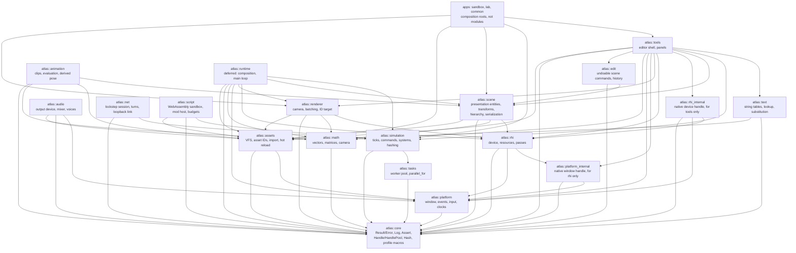
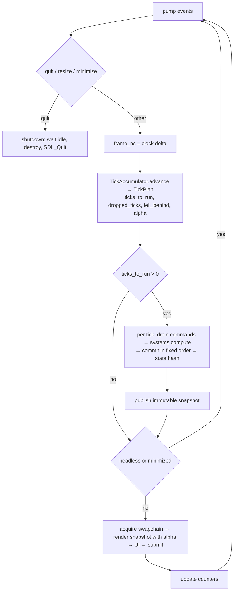

# Architecture

Atlas is a set of static-library modules composed by an application. Every module boundary
is a CMake target; the permitted dependency edges live in `cmake/ModuleGraph.cmake` and are
enforced at configure time and again in CI by `tools/check_module_deps.py`, which also
checks that the diagram below draws exactly the edges the table permits. It had drifted
five ways before M9, so it is now compared rather than trusted.

## Module graph

`atlas::runtime` does not exist. The plan created it in M5 on the assumption that a second
application would need the same composition. M7 brought that second application, the
Strategy Lab, and the assumption was tested line by line: what the two shared was about two
hundred lines of pure utilities (argument plumbing, a frame-time ring, a PPM writer, the run
bounds, the process boundary) and not the frame loop, because the sandbox drives a scene graph
and the lab drives the simulation kernel. The utilities became `apps/common`, a static library
with tests; a `runtime` module remains deferred until a third application, or the two loops
converging in shape rather than in ingredients. `tools` and `apps` therefore depend on the
engine modules directly, which is what the graph above shows.

The lab itself is three targets, and the split is load-bearing: `atlas::lab_sim` holds the
tables, systems, command and snapshot and may link only `atlas::simulation`, which CMake
refuses to let it exceed, so the headless benchmark is independent of rendering by
construction; `atlas::lab_view` holds the cell field and the identifier pass, so the GPU tests
draw with the application's own code; and `apps/lab/main.cpp` is the composition root that
puts a window, a device and an overlay around them.

Third-party libraries are private to the modules named here and to no others: SDL3 to
`platform` and `rhi`, EnTT to `scene`, nlohmann-json to `scene` and `assets`, Dear ImGui to
`tools`, Tracy to `core` behind compiled-out macros, WAMR to `script`. The sentence used to say
"exactly one module" and then name two for both SDL3 and the JSON reader; what it means is that
the list is closed, not that each entry has one name. EnTT is permitted in `atlas/scene` headers by ADR-0004 and does not
appear in any of them.
Because static-library `PRIVATE` dependencies propagate as `$<LINK_ONLY:>`, a public
header that includes a third-party header fails to compile in an application. That is the
primary enforcement; the script is the backstop.

`atlas::platform_internal` is an INTERFACE target exposing `SDL_Window*` behind a forward
declaration. Its only permitted consumer is `atlas::rhi`.

## Ownership

| Module | Owns | Never |
|---|---|---|
| core | Errors, logging, assertions, handles, hashing, build info, profiling macros | Knows about windows, GPUs, entities, or ticks |
| math | Vectors, matrices, rectangles, projections | Holds determinism-sensitive simulation logic without tests |
| platform | SDL lifetime, window, events, input, clocks, mount roots | Exposes SDL types in public headers |
| tasks | Worker pool and deterministic parallel-for | Exists before the first parallel benchmark |
| rhi | GPU device, resources as generation handles, passes, uploads | Exposes SDL types; knows about scenes or maps |
| renderer | Camera, batching, targets, culling hooks, debug draw | Mutates simulation or scene state |
| assets | Virtual paths, asset IDs, importers, load states, hot reload | Touches the GPU directly |
| audio | The output device, the mixer, clips and voices | Reaches simulation or scene state, or produces anything that is hashed |
| scene | Presentation entities, transforms, hierarchy, serialization | Is the grand-strategy database |
| animation | Clip evaluation, the clip cache, and the derived pose it writes | Writes an authored component, or produces anything that is hashed |
| simulation | Ticks, commands, system contracts, RNG, hashing, replay, snapshots | Contains game rules |
| net | Lockstep sessions, turns, the message codec, a bounded inbox, an in-memory link, and a socket transport behind `net::Link` (ADR-0017) | Reaches the world, the scene or anything that draws; owns a thread, or lets a socket type into a header |
| script | The WebAssembly sandbox, the mod loader, the instruction and memory budgets, the mod host | Gives a guest any authority it was not handed, or lets one reach state except through a command |
| text | String tables as assets, the catalog that finalises them, and a substituter that cannot throw | Formats with the standard library's runtime path, or holds a string the log also has to print |
| runtime | Composition, main loop, subsystem lifetimes | Depends on tools or editor code |
| edit | Undoable scene commands, the history that applies them | Holds a UI type; is the simulation's command queue; is depended on by anything that draws |
| tools | Editor shell, panels: statistics, scene, log console, simulation controls, asset status | Is depended on by runtime modules |
| apps | Composition roots and demonstrations | Hold reusable engine logic |

## Time model

Three distinct notions of time:

| Notion | Representation | Drives |
|---|---|---|
| Real time | `SteadyClock` in core, nanoseconds | UI responsiveness, frame pacing, the accumulator input |
| Render time | seconds since start, plus `alpha` in [0,1) | Visual effects. **`alpha` is computed and, as of M13, interpolates nothing**: its only readers pace a headless frame. Snapshot interpolation is the consumer it was added for and is deferred; see DEFERRED.md. |
| Simulation time | `Tick`, a 64-bit integer counter | Authoritative state, commands, hashes |

Rendering never defines simulation correctness. Simulation advances in fixed logical ticks,
never by a variable frame delta.

## Main loop and snapshot flow

Speed is a scheduler policy, never a multiplier inside simulation equations. The policies
are `Paused`, `SingleStep`, `Realtime{num, den}`, and `Unbounded{batch}`. Interactive
policies clamp catch-up work per frame and report how far behind the simulation fell;
surplus ticks are discarded rather than retained, which is what prevents an unbounded
spiral. Unbounded mode ignores wall time and skips rendering to maximise throughput.

The accumulator is integer-only. It is kept in units of nanoseconds multiplied by the tick
rate, so a tick is exactly one billion units at any rate and 60 Hz has no fractional
period. It takes no clock of its own, which is what makes it directly unit-testable, and it
is the reason the steady clock lives in core rather than in platform: nothing in the time
model needs a window system.

### Headless, and why there is no null platform

Headless is a configuration, not a second implementation. `PlatformConfig::video = false`
initialises no video subsystem, and window creation then fails with an error that says so.
A null platform returning stub windows would turn a configuration mistake into a mystery
somewhere else, and would be a second code path to keep working for no user.

Window code is still exercised where there is no display, through SDL's `dummy` video
driver: a real window and a real event pipeline with nothing behind them. That is how
continuous integration covers window creation, resizing and destruction. What it cannot
cover is anything a real window server decides, such as minimise and restore; those are
covered by injecting the events, which tests the translation Atlas is responsible for.

Window state such as minimised or focused is queried from the window system rather than
tracked from events. Tracked state drifts out of sync when an event is missed; a query
cannot.

Snapshots carry presentation-relevant, plainly-copyable, stably-ordered data only. They are
published as `shared_ptr<const Snapshot>` with latest-wins semantics; a renderer pins one
snapshot for a whole frame. This is the one place shared ownership is permitted, and it is
what allows the simulation to move to its own thread later without changing the renderer.

## Input

Three kinds of input reach an application, and they are deliberately shaped differently
because they answer different questions.

**Events are transitions.** A key going down, a button going up, a window being resized, a
character being committed. They arrive in a `std::vector<Event>` from `pump()`, in the order
the window system delivered them, and a consumer that misses one has missed something that
happened. `Event` is a `std::variant` and is **trivially copyable**, asserted rather than
merely intended, so a copy is a memcpy and `pump()` allocates nothing after warm-up.

**`InputState` is level.** Which keys are down now, where the pointer is, how far a stick is
pushed. A consumer that reads it every frame needs no history. Only `Platform` may write it;
every accessor is public and every mutator is private with `Platform` a friend, which is what
makes a frame of input reproducible from a struct in a test without a window system.

**Window state is queried, never tracked.** Minimised, focused, size. Tracked state drifts
when an event is missed; a query cannot.

### Text, and why it is not keys

A key is a position on a keyboard; a character is what an input method decided the person
meant. They are not the same and one is not derivable from the other, so committed text
arrives as its own event carrying UTF-8 bytes.

The bytes are **inline, 63 of them plus a terminator**. A `std::string` would allocate inside
`pump()` and cost `Event` its trivial copyability; a view into a scratch arena would dangle
the moment a consumer kept an event past the next pump. The cost of the inline buffer is that
a longer commit arrives as **several consecutive events, each cut on a code-point boundary**,
which is lossless because committed text is a stream that every consumer appends in order.

An input method's **in-progress composition** is a different thing again: it is state, not a
stream, because each update replaces the last. So it truncates rather than splitting, and
says that it did.

**Text input is off unless something is focused.** Nothing but a focused field wants it: with
an input method active every key routes through the method, so a space bar stops pausing the
simulation and starts confirming a candidate, and every key would produce a character *and* a
key event, so a shortcut key would also type. The overlay knows when a field is focused, so
the application asks it once a frame and tells the window.

### Gamepads are slots, not devices

`GamepadId` names one of four slots. The platform assigns the lowest free slot on connect and
releases it on disconnect; the window system's own device identifier never leaves
`platform/src`, because it is not stable across runs and would end up in a saved binding if
it were exposed. Face buttons are named by position rather than by letter, because the button
in the south position is "A" on one vendor's pad and "B" on another's.

There is **no axis event**. An axis is level state with no transition worth naming, a resting
stick would be the first thing to exhaust the event reserve, and every consumer polls. The
dead zone is applied once, in the platform, with a rescale so that full deflection still
reads exactly one — applied twice it is a bug, and the window system's raw range is
asymmetric, so normalising belongs where that type lives.

The subsystem is **off by default**. Without video there is no application, so video defaults
on; without a gamepad every application still works, so it is a peripheral a composition root
opts into. It initialises as its own subsystem, so a failure is a warning rather than a
refusal to run.

## Audio

Audio is presentation, and the separation is structural rather than a promise. `simulation`
depends on `core` and `tasks` only, so an audio include there fails the boundary check, and the
Strategy Lab's simulation library is fenced at configure time to link nothing but
`atlas::simulation`. **A sound is triggered where a command is submitted or where a snapshot is
observed, never inside a system.** Nothing audio produces is hashed, and every golden hash was
byte-identical across the milestone that added it.

**The mixing runs on the main thread, once a frame.** Once per frame the device measures what
the window system still holds, mixes enough to reach a 60 ms target, and pushes it. No callback
is registered, so the window system's audio thread drains the stream itself and never enters
Atlas code — which is why nothing here needs a rule about what may not allocate or log.

The price is stated rather than hidden: a frame longer than the queued audio is heard as a gap,
and the statistics count exactly that. A million-cell tick at thirty ticks a second never
underran; the same at sixty, already beyond what that tick sustains, underran once in six
hundred frames. Both bounds are configuration, and [ADR-0011](adr/0011-audio.md) records the
callback mixer as the rollback with its trigger.

**Everything converts to one mix format on the way in**: 48 kHz, stereo, float32. That is what
lets the mixer be pure functions over buffers with no branch on rate, format or channel count,
and therefore what lets the arithmetic be tested exactly on a machine with no sound card.

**A missing sound is silence, and deliberately has no fallback.** A missing texture resolves to
a magenta checkerboard because something must still be drawn; a missing sound has nothing it
must still do, and inventing a noise would be worse than silence. The registry says whether it
is missing, failed or still loading, and the asset panel shows which.

**The platform brings the audio subsystem up**, behind a configuration flag, exactly as it does
for gamepads. The audio module opens a device on it, the way the renderer opens a graphics
device on a window it did not create. SDL's lifetime stays in one module, whose destructor
tears every subsystem down at once.

## Threading model

v0.1 was single-threaded by design, and since M8 the simulation's compute phase runs on
`atlas::tasks` workers when a pool is supplied. Every platform and RHI entry point asserts main-thread
affinity.

| Thread | From | Owns | Must not |
|---|---|---|---|
| Main | M0 | SDL, window, GPU device and all submission, UI, simulation stepping | Block on long I/O inside a frame |
| Asset I/O workers (2, inside `assets`) | M4 | File reads and decoding into CPU buffers | Touch platform, GPU, scene, simulation, or UI |
| Simulation workers (`tasks`) | M8 | Per-system private scratch and output buffers | Mutate shared tables, or touch anything outside simulation |
| Audio device thread (created and owned by the window system) | M12 | Draining the output stream into hardware | Runs no Atlas code at all; registering a callback on it needs a new ADR |

A render thread is not planned for v0.1 and requires trace evidence plus documented
affinity rules before it could be considered.

## Renderer

`atlas::rhi` is the whole of Atlas's contact with the graphics library. Its public headers
name handles, descriptors and enumerations of Atlas's own; every SDL type stays in
`engine/rhi/src`. The native window handle reaches it through `atlas::platform_internal`, a
target whose only permitted consumer is the renderer, so the one place the boundary has to
open is named in the build system rather than in a comment.

Resources are generation-counted handles from a pool. Destroying a resource bumps its slot's
generation, so an outstanding handle stops resolving rather than dangling, and the device's
destructor reports by name anything still live. SDL_GPU already defers destruction until the
graphics processor has finished with a resource, so there is no deletion queue; ADR-0002
records that reliance.

A frame is a scope. `begin_frame` acquires a command buffer and waits for a swapchain image;
a frame that is dropped without being submitted releases it. Which release is legal depends
on whether an image was acquired: SDL refuses to cancel a command buffer holding one, so
such a frame is submitted instead. A minimised window yields a frame with no image, which is
not an error, and the caller skips drawing.

GPU-side timing is not available: SDL_GPU exposes fences but no timestamp queries. Profiling
zones therefore measure acquire, record and submit on the processor side, and anything
reported as GPU cost says which it is.

### Drawing

`atlas::renderer` turns quads into draw calls. One quad is an instance: four shared corners
from one vertex buffer, plus the position, size, texture rectangle and colour that make it
different. Ten thousand quads are one buffer upload and one draw. A batch breaks when the
texture changes, because a draw reads one texture, and it reports what it did so that the
cost is visible rather than guessed at.

`atlas::math` holds the camera and the matrices. Matrices are stored row-major, which is how
they are written down and how the tests read, and converted on the way to a uniform, because
shading languages read a uniform matrix column-major. That conversion is a named function
rather than an implicit step: getting it wrong drops the translation and warps the scene,
which looks like a shader bug and is not.

`atlas::tools` is the engineering overlay. The immediate-mode library behind it is private,
and its input is driven from Atlas's own event types rather than through its platform
backend, which would have required window-system types inside the module. Uploading its
vertex data begins a copy pass, and a copy pass cannot nest inside a render pass, so
preparing and drawing are separate calls and the second requires a token produced by the
first.

### Assets

Nothing above `atlas::assets` names a directory. An asset lives at a virtual path, roots are
mounted with priorities, and a path resolves against the highest-priority root that has it,
which is how a modification directory shadows base content without either knowing about the
other.

Normalisation is a security boundary, because asset packs and modifications are untrusted
input. Upward traversal is refused rather than resolved: resolving it correctly is possible
and resolving it subtly wrongly is a directory escape, and no legitimate asset path needs it.
A resolved path is then checked to lie inside its root, because a symbolic link can point
anywhere and what matters is where a path ends up.

Loading is asynchronous through a small pool owned by the assets module, deliberately not
`atlas::tasks`. That pool exists since M8, so this is a choice rather than a limitation: the
specification wants asset work kept separate from deterministic simulation scheduling, and a
blocking file read on a simulation worker would stall a tick. A worker sees only bytes: never the window, the
graphics device, or engine state. It produces decoded data and stops, and the main thread
turns that into a graphics resource, because only the main thread may. That split is the
whole reason loading can be asynchronous at all, and it is why an asset has a `Decoded` state
distinct from `Ready`.

A missing or broken asset is recorded and resolves to a fallback rather than stopping the
engine. An engine that halts because one texture is corrupt is much harder to work on than
one that draws a magenta square and says why.

### Device loss

A graphics device can stop working underneath a running process: a driver resets, a display
is unplugged, a processor hangs or is removed. Everything afterwards fails, so without
handling it the log fills with unrelated-looking errors and the cause is buried.

Atlas detects it and stops. The first failure that says the device is gone latches, and every
later `rhi` call returns `DeviceLost` immediately with the original reason rather than trying
work that cannot succeed. `Device::is_lost()` reports it.

Atlas does not recover. Recovery means recreating the device and every resource on it, which
the charter puts out of scope for v0.1.

Detection is backend-dependent and the limits are real rather than temporary. The graphics
library exposes no device-lost query at all, so this works by reading the message it leaves
behind. Vulkan is reliable, because the library formats the driver's result code in verbatim.
Direct3D 12 is best effort, because the message is system prose whose wording depends on the
reason and the language. Metal has no device-lost notion that reaches the library, so on
Metal a lost device presents as ordinary failures and nothing latches.

## Scene

The scene is a tree of presentation entities: names, transforms, parentage, sprites, and
cameras. It is not the grand-strategy database, and nothing in it should acquire a field
because a future game might want one. Provinces, populations and armies live in
structure-of-arrays tables chosen from measured query patterns, for the reasons in
[ADR-0004](adr/0004-scene-ecs-vs-simulation-storage.md).

**Identity is Atlas's, not the library's.** Callers refer to entities by `StableId`. The
entity library's own handle is recycled as entities come and go and means nothing outside one
run, so a file that recorded one would load without complaint and refer to different
entities. `Scene` keeps the mapping and never lets the library's handle escape.

**Everything observable is ordered by identifier.** Iteration, draw order, sibling lists and
the saved file are all sorted on the way out. The entity library stores components in
whatever order suits its compaction, and inheriting that would make what overlaps what, and
what a file looks like, depend on the order things happened to be created.

**World transforms are derived and recomputed, never authored.** `update_transforms` walks
parents before children once per batch of changes rather than on each change, because
composing a child needs its parent to be current. Depth is bounded, and a cycle is refused at
the moment of reparenting rather than discovered when the walk fails to terminate.

**Destroying an entity destroys its children.** A child whose parent is gone has a transform
relative to nothing, and leaving that state reachable would mean every reader has to handle
it.

Serialization is canonical, versioned, and treats its input as hostile; the format and the
reasoning behind it are in [ADR-0007](adr/0007-scene-file-format.md).

The scene is edited only through `edit::History`. The overlay's panel takes the history, which
exposes its scene as const and changes it only through commands it can undo, so the compiler
still enforces that no widget becomes a second way in — the same guarantee the const reference
gave from M5, now with editing behind it rather than instead of it. M9's first widget was the
local position; M11 added the name, M13 the animator's playing, speed, start and loop mode. The
remaining commands exist and are tested, and their widgets follow one at a time.

## Animation

Animation is presentation, on the same footing as audio and by the same structural argument:
`animation` depends on `core`, `math`, `assets` and `scene`, and cannot reach `simulation` or
`renderer` without the boundary check failing. Nothing it produces is hashed, enters authoritative
state, or reaches a saved file.

**What it is not** is stated as plainly as what it is. It is **not deterministic across
machines**, because the frame time that drives it is not: two machines run different numbers of
frames per second and hand it different steps. What it *is*, and what every test rests on, is
bit-exact given the same sequence of steps on one build — it reads no clock of its own, so a
test can drive a thousand frames in no time and get the same answer twice.

**Two writers, and they never touch the same field.** `LocalTransform` is what the author typed,
what `edit::History` changes, and what the file saves. `AnimationPose` is what the animator
computed this frame, and is derived exactly as `WorldTransform` is: recomputed, never authored,
never serialised. `update_transforms` composes the two — position adds, rotation adds, **scale
multiplies**, so an untouched pose is the identity. An entity can therefore be dragged in the
inspector while a clip is moving it: the drag moves the orbit, and undo takes back the drag and
never the animation. [ADR-0012](adr/0012-scene-format-v2.md) records the decision, including
that it *replaced* an earlier rule forbidding an application to animate what the user can edit.
That rule made the editor unusable on the one scene it existed to edit.

**The clock is integer end to end.** Milliseconds in the file, because that is what a person
tunes and what every sprite tool exports; nanoseconds in memory, because a frame is sixteen and
two-thirds milliseconds and truncating it loses two-thirds every frame. There is no float
accumulation anywhere in it, which is what makes a clip exact after an hour of looping and what
turns "wrap or accumulate?" into a question with no consequences. The one place the step meets
floating point is the playback-speed multiply, and it is rounded back to whole nanoseconds
immediately.

**Every easing is exact at both endpoints.** `ease(0)` is zero and `ease(1)` is one, to the bit,
and the blend is written `(1 - t) * a + t * b` for the same reason. That is what lets a test
assert a key's own value with `==` rather than with a tolerance, and what stops a clip drifting
away from the pose its author typed.

**Frames address cells of a uniform grid** — columns, rows, and an index counted left to right
then top to bottom. Normalised rectangles are hostile to write by hand and change meaning when a
sheet is re-exported at another size; pixel rectangles need a texture size, which this module
never sees because it does not know what a texture is. Frame animation costs the renderer
nothing at all: a sprite already carries a rectangle, so the draw path prefers the pose's when a
clip has set one.

**`advance` is a free function**, not a system or an object: the per-entity clock lives in the
component and the clip data in the cache, so there is nothing for an object to hold. A clip the
cache does not have leaves the entity at the identity pose and is counted rather than logged,
because a clip still loading is the ordinary case for the first few frames — and identity rather
than the last pose, so a clip that failed to load looks like no animation instead of like one
that has frozen.

The clip file format, and why a document parser's hostile-input discipline is not the WAV
reader's, are in [ADR-0013](adr/0013-animation-clip-format.md).

## Networking

Deterministic lockstep over the command queue, and nothing else — the meaning ADR-0010 fixed and
[ADR-0014](adr/0014-deterministic-lockstep.md) designs. Until M17 there was **no transport** by
decision, and nothing in `vcpkg.json`; [ADR-0017](adr/0017-lockstep-transport.md) chose ENet
against the five criteria 0014 recorded, and two processes now agree hash for hash over a real
socket.

**Everything a session does sits behind `net::Link`**, an interface of four calls. The in-memory
hub and the socket hub both implement it, and `net::Session` cannot tell them apart — which is
what makes the loopback suite the proof that the seam is real: it did not change when the socket
arrived. No ENet type appears in any header, so replacing the transport would touch one class.

**Direct address only**: connect by host and port. No encryption, no traversal, no lobby, each
deferred with a trigger. And **a peer that goes quiet ends the session** rather than being
dropped, because dropping it is simulation-visible — every remaining peer would have to apply
the drop at the identical tick or diverge, which needs an agreement protocol of its own.

**A tick runs only when every participant has said what it is doing on that tick.** Every peer
then applies the same commands in the same order, in the total order `(source, sequence)` fixes,
and reaches the same state **without exchanging any state at all**. That is the whole idea, and
it is affordable only because the simulation was already deterministic: kilobytes a second of
turns rather than megabytes of world.

**Readiness depends only on which sources have reported, never on time.** `sim::TurnGate` reads
no clock, holds no deadline and has no timeout. The moment readiness could turn on elapsed time,
two machines at different frame rates would run different ticks with different commands — the
exact failure that stamping a command with its target tick was introduced to prevent. Deciding
what to do about a peer that has gone quiet is a transport policy, and it reaches the simulation
only as a change to the expectation set.

**The kernel refuses a tick the gate has not cleared**, rather than trusting its caller to ask.
That widened `Kernel::step`'s contract, which is recorded in the ADR rather than left to be
discovered. The refusal is placed before the command drain, because `drain` removes what it
returns: refusing after it would discard the tick's commands and the retry would reach a
different state from every peer.

**The cost is the stall, not the bandwidth.** A peer late by more than the agreed input delay
freezes everyone, and no amount of bandwidth fixes that. Lockstep does not degrade gracefully;
it waits.

**A divergence is detected, attributed to the first system whose writes differ, and stops the
session.** Atlas does not resync — the same treatment device loss gets. The recordings on each
side are the debugging artefact.

**No new thread.** The loopback link and every session run on the main thread, so the threading
table above is unchanged. `net::CommandInbox` is nevertheless safe to push into from any thread,
because that is where a transport's receive thread would hand work across, and it is bounded
because its producer would then be a peer rather than something this process controls.

## Scripting

Mods are untrusted WebAssembly, run in a sandbox, reaching simulation state only through the
command queue. Decided by [ADR-0015](adr/0015-sandboxed-mods.md); the boundary they respect was
fixed by [ADR-0009](adr/0009-scripting-decision.md) decision 2 in M9 and has not moved since.

**The import list is the whole of a guest's authority.** WebAssembly has no ambient anything: a
module can touch its own linear memory and the functions it imports, and nothing else. So
`engine/script/include/atlas/script/atlas_mod.h` is not a summary of what a mod can do, it *is*
what a mod can do, and the loader refuses any import not in it. What is missing from that header
is the design:

| Not offered | Because |
|---|---|
| A clock | A mod that reads one decides differently on a slower machine, which under lockstep is a divergence. `atlas_tick` gives the simulation's tick, identical everywhere. |
| A filesystem, a network, an environment | A mod is untrusted input from a mounted directory. It reads views and submits commands. |
| An allocator or a libc | WASI and WAMR's built-in libc are compiled out of the port. A guest that wants a heap brings one inside its own memory. |
| A generator of its own | `atlas_random` is keyed by seed, tick and the mod's identity, so two peers draw the same numbers and a recording replays them. |

**A mod never says who it is.** `atlas_submit` has no source parameter: the host stamps the
mod's own identifier and the target tick. Claiming to be another peer is unrepresentable rather
than forbidden — M14 first put that restriction in the interface every command source shares,
found it wrong for a lockstep session, and removed it; it belongs with the untrusted producer,
which is `script::ModHost`.

**A mod's identifier has bit 31 set** (`sim::kModSourceBit`), so it can never be confused with a
peer, whose index comes from its position in the session. Mod commands are **never sent on the
wire**: every peer runs the same mods and each produces the same commands locally, and the hash
check is what catches one that decided differently.

**A mod is called once per kernel tick, before that tick** — never once per frame. Peers run
different numbers of frames per tick, so a per-frame call would make a mod's output depend on
frame rate.

**What a mod reads is the application's, not the engine's.** Views are flat runs of bytes,
recomputed from the world at the tick boundary, whose meaning the application defines: the
engine has no game state to describe, since `sim::Table` exposes a row count and how to hash
itself and no accessor at all. They are deliberately not the presentation snapshot, which is
latest-wins, published once a frame, and absent headless.

**Failure is device loss, not recovery.** A trap, an exhausted instruction budget, a refused
allocation or a non-zero `mod_init` disables that mod for the session and logs once. Other mods
continue and the engine never stops because a mod did. Nothing is ever re-enabled or retried,
because under lockstep "try it again" is a decision one peer might take and another might not.

**The one place a rule bends.** `script::Runtime` is the second process-wide object in Atlas
beside the log sink registry, because WAMR's initialisation is process-global. It is an RAII
object the composition root creates once and asserts is unique, exactly as `Platform` wraps
SDL's, and ADR-0015 names it rather than letting the rule widen quietly.

The threading table above is unchanged: everything here runs on the main thread, with the
kernel. A mod thread is deferred.

## Text

Implemented in M16, decided by [ADR-0016](adr/0016-string-tables.md).

`atlas::text` is a string table asset, a catalog that answers a key, and a substituter. It has
exactly one module consumer, `tools`, and that is a constraint on the design rather than an
observation about it: `core::to_string(Severity)` and `assets::to_string(AssetState)` keep their
own words and gain no dependency, because those words are log text as well, and routing them
through a table would make every integration case's grep depend on a locale. The overlay maps
enumeration to key on its own side.

**A missing key returns the key.** Never an empty string, never an error — the same instinct as
a missing asset resolving to a fallback rather than stopping the engine. It also means the
catalog may be absent: the overlay takes a `const Catalog*` and null resolves every key to
itself, so the absent-catalog path is the same code as the missing-key path rather than a second
one nobody exercises.

**Substitution is hand-written, positional, and cannot throw.** `std::format` type-checks its
format string at compile time, which is right everywhere else and a wall here: a pattern loaded
from a file will not convert. `std::vformat` throws `std::format_error`, which ADR-0005 forbids
crossing a module boundary and which `tools/check_module_deps.py` enforces mechanically. Forty
lines that cannot throw need no allow-list entry, and positional indices are needed anyway,
because word order differs between languages and `{}` in sequence cannot express that.

**English is the only table, and a second language is a data change only for Latin-1.** The
overlay renders Dear ImGui's default baked atlas — Basic Latin and Latin-1 Supplement. French,
German, Spanish and Italian would render from a translated file; Polish, Greek, Russian and
every CJK language would show blanks until somebody bundles a font and configures glyph ranges.
`DEFERRED.md` records that with its trigger.

The threading table above is unchanged: a catalog is main-thread only, and `lookup` is `const`
while still recording what it could not find.

## Simulation contract

Implemented in M6, parallelised in M8.

**A tick is four steps, always in this order.** Drain the commands stamped for this tick and
apply them in `(source, sequence)` order. Compute, batch by batch. Commit, system by system in
declared order. Hash the result.

**A command has three fates, and a handler decides the third.** Late — stamped for a tick
already run — is a protocol violation under lockstep. Invalid — bad bytes — is refused by the
handler's validator and counted. Declined — well-formed, on time, and refused by the world —
is the handler's own verdict: `apply` receives who submitted the command and at which tick,
and returns a status (ADR-0019). A handler that declines has changed nothing, and because a
decline depends only on state every peer shares, every peer makes the same one.

**Everything from outside enters through a command.** Input, a script, a network peer and a
replay all take the same path. That is not tidiness: if anything else could reach state,
recording commands would not be a recording of what happened, and a replay would not be a
replay. Commands name the tick they apply to and are never applied on arrival, because arrival
depends on frame rate, network and thread scheduling, and none of those may influence results.

**Compute and commit are separated by `const`.** The compute phase receives a `const World`
and writes only storage its own system owns; the commit phase receives a mutable one. The
compiler enforces the split, so a system cannot write shared state while another reads it even
by mistake. This is the single reason moving compute onto workers in M8 was a scheduling change
rather than a redesign.

**Batches are derived here and executed by the kernel.** Systems that share no table in a
conflicting way are grouped, following declared order so the grouping is reproducible. M6 ran
one system at a time regardless; since M8 a batch holding more than one system is dispatched
across the worker pool. Deriving them also makes a wrong access declaration fail today instead
of becoming a data race later.

**The kernel knows nothing about what a table holds.** A table is asked to hash itself and to
write and read itself, and nothing more, so layouts stay the application's choice per measured
query as ADR-0004 intends. Table identity is the hash of its name, so a save written by one
build reads in another that registers its tables in a different order.

**Ordering is imposed, never inherited.** Tables are kept sorted by identifier, commands are
sorted by source and sequence, and systems run in declared order. Nothing observable depends
on the order things happened to be created or arrive.

**Randomness is counter-based.** A value is a pure function of seed, stream, tick and counter,
with no generator carrying state between ticks and no ambient one. With a shared stateful
generator, adding a single call anywhere shifts every later value everywhere, and a replay
stops matching for a reason that has nothing to do with the change.

**A canonical hash is computed each tick, with per-system sub-hashes.** The sub-hashes are what
make a divergence attributable rather than merely detected: a bare state hash says only that
something differs somewhere.

**Snapshots carry presentation data to the renderer.** The renderer never reads authoritative
state. After a tick the simulation publishes an immutable snapshot of what is worth drawing,
and the renderer holds one for a whole frame, so what it draws is a single consistent moment.
Latest wins with no queue, because a renderer that fell behind would be drawing history and
the backlog would only grow.

**Determinism does not come from the fixed timestep.** It comes from the command order, the
system order, the commit order, and the numeric rules in [DETERMINISM.md](DETERMINISM.md). The
tick loop only decides how many times to run.

## Error handling and failure

`atlas::Result<T>` is `std::expected<T, atlas::Error>`. An `Error` carries a code, an
owning message, a source location, and an optional native error code, and can accumulate
context as it propagates. Exceptions are never thrown by engine code and never cross a
module or thread boundary; third-party failures are translated at the boundary.

Assertions are for violated programmer invariants and abort. Recoverable user or data
errors return an `Error`. Untrusted inputs (assets, saves, replays, mods) are validated for
counts, lengths, versions, and bounds before any allocation or indexing.
